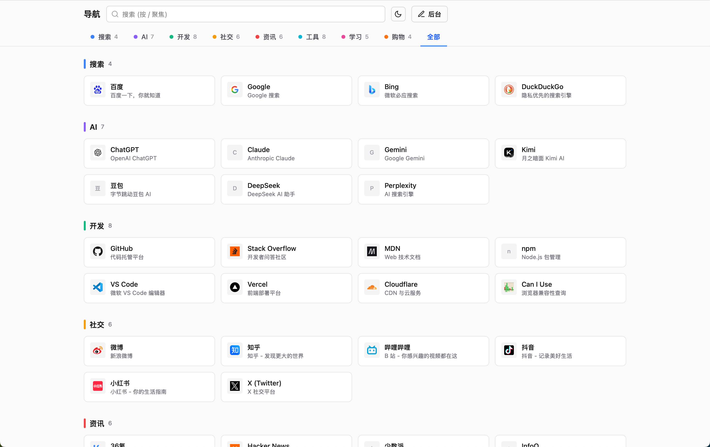

# Nav — 个人导航页

一个简洁、可自定义的个人导航页，基于 React + TypeScript + Tailwind CSS 构建。

**在线预览**: 部署到 GitHub Pages / Vercel / Cloudflare Pages 后即可访问。



---

## 功能

- 分组标签页切换
- 全局搜索（跨所有分组）
- 明暗主题切换
- 连通性检测（Ping）
- 内置后台编辑器，可视化增删改网站和分组
- 配置文件导入 / 导出（JSON）
- 支持子分组（子标签筛选）
- 纯静态，零后端，可部署到任意静态托管平台

---

## 快速开始

```bash
# 克隆仓库
git clone https://github.com/your-username/nav.git
cd nav

# 安装依赖
npm install

# 启动开发服务器（含后台编辑功能）
npm run dev

# 生产构建（只读导航页，无后台）
npm run build
```

---

## 自定义网站

### 方式一：编辑 `public/config.json`

直接修改 `public/config.json`，按照如下结构添加分组和链接：

```json
{
  "title": "导航",
  "groups": [
    {
      "id": "search",
      "name": "搜索",
      "color": "#3b82f6",
      "sites": [
        {
          "id": "baidu",
          "name": "百度",
          "url": "https://www.baidu.com",
          "description": "百度一下，你就知道",
          "icon": "https://www.baidu.com/favicon.ico",
          "openInNewTab": true
        }
      ]
    }
  ]
}
```

### 方式二：使用内置后台

运行 `npm run dev` 后，点击右上角「后台」按钮，进入可视化编辑模式，修改完成后下载 `config.json` 覆盖 `public/config.json` 即可。

---

## 配置说明

### Site 字段

| 字段 | 类型 | 说明 |
|------|------|------|
| `id` | string | 唯一 ID（随机字符串即可） |
| `name` | string | 网站名称 |
| `url` | string | 网站地址 |
| `description` | string? | 描述（悬停显示） |
| `icon` | string? | 图标 URL 或 SVG 字符串 |
| `openInNewTab` | boolean? | 是否在新标签页打开 |
| `probeUrl` | string? | 连通性检测 URL（默认用 favicon.ico） |
| `subgroupIds` | string[]? | 所属子分组 ID |

### Group 字段

| 字段 | 类型 | 说明 |
|------|------|------|
| `id` | string | 唯一 ID |
| `name` | string | 分组名称 |
| `color` | string? | 标签颜色（十六进制） |
| `sites` | Site[] | 网站列表 |
| `subgroups` | Subgroup[]? | 子分组列表 |

---

## 部署

### GitHub Pages

```bash
# 构建
npm run build

# 将 dist/ 目录推送到 gh-pages 分支，或配置 GitHub Actions 自动部署
```

### Vercel / Cloudflare Pages

连接 GitHub 仓库，框架选 Vite，构建命令 `npm run build`，输出目录 `dist`，一键部署。

---

## 技术栈

- [React 19](https://react.dev)
- [TypeScript](https://www.typescriptlang.org)
- [Vite](https://vitejs.dev)
- [Tailwind CSS v4](https://tailwindcss.com)

---

## License

MIT
